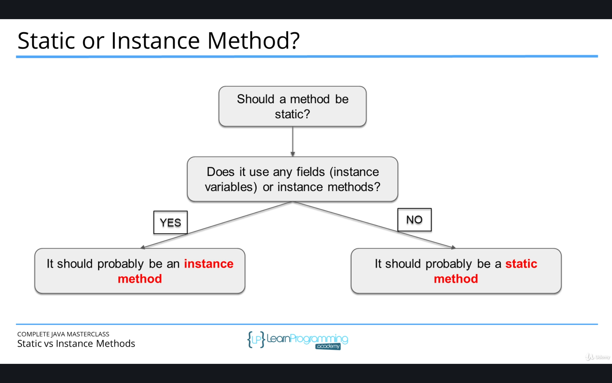

# Classes and Objects


`Class` is a blueprint to construct objects

**State** - things the object Knows

* variables -
  - variables must have `type` and `name`
  - two flavours of variables
    - primatives
    - object references

declaration -> `int score = 509;` <- assignment

**Behaviour** - things the object does

* methods

```java
Class Rectangle {
  private int width;  <- instance variables
  private int length;

  public int getArea(){
    int total = width * length; <- local variable
    return total;
  }

  public void setLength(int length = 4) {
    this.length = length;
  }
}
```

- instance variables defined a top class
- local variables - local to method, doesn't exist after execution

## Method Overloading

* method with same name but different parameters

### Constructors

constructors same name as class

```java
Class Film {
  int year;
  String title;
  int length;
  String language;

  public Film () {}

  public Film (int year, String title, int length, String language)
  {
    this.year = year;
    this.title = title;
    this.length = length;
    this.language = language;
  }
}
```

if a constructor is defined all arguments must be passed for it to compile properly.

You can have multiple constructors, with the same name but with different number of arguments. 

<!-- constructor chaining is where you have overloaded constructors  -->
### instantiating an object

  `Movie movie1 = new Movie(1999, 100);`

  in this example movie1 is the object reference.

  object reference gives access, not the object itself

  you pass it the parameters of the constructor


### this vs super

* **super** is used to access call parent class variables and methods
  * used in method overiding 
  * call method with same name from parent class - stops recursion. 

* **this** is used to call the current class variables and methods. 
  * required when there is a parameter with the same name as the instance variable
  * can't use in `static` blocks

* **`this()`** to call a constructor from another overloaded constructor in the same class. 
* **`super()`** calls parent constructor
  * must be first statement
* constructor can have calls to both `super()` and `this()`

## Inheritance 

- a class can extend a parent class - eg. animal is a type of dog 
  - a dog extends the class of animal

```java
class dog extends animal {
  int tail 

  public dog(String name, int tail) {
    super(name, tail)
    this.tail = tail;
  }
}
```
## Method overrding 

* defining a method in child class that already exists in the parent class 
* called runtime time polymorphism and dynamic method dispatch
* `@Override` above method - annotation 
  * must have same name and arguments
  * return type can be subclass of the return type in the parent class
  * can't have a lower access modifier
* only inherited methods can be overwritten
* Constructors and private methods cannot be overridden

## Static methods

- declared using the static modifier
- can't access instance methods or variables 
- usually used for operations that require any data from an instance of class



