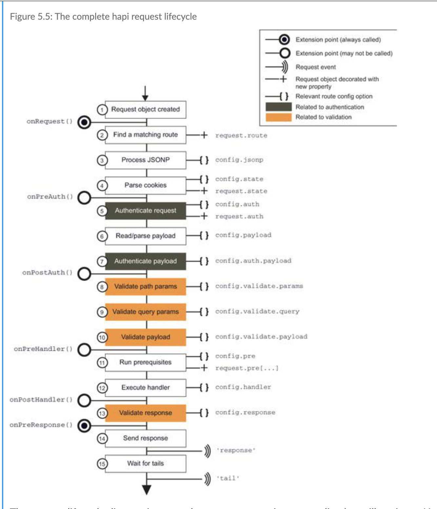

# Node.js

## Buffer
- transfer data 
- temporary storage chunk of data 
- when buffer full it can passed on.
- Start consuming data even before it arrives
- increase performance 
- read and write files. 

## DNS
node internal module for domain name resolution

[lookup](https://nodejs.org/api/dns.html#dns_dns_lookup_hostname_options_callback) doesn't neccessarily perform network operations, but performs on the operating system.

- params:
    - `hostname` : <string>
    - `options`: <object> | <integer> , if it is an integer it must be either `4` or `6` all are optional, if not provided both IPv4  & 6, can include -
        - `family` : <integer> - the type of ip either `4` or `6`
        - `hints` : <number> One or more supported `getaddrinfo` flags, multiple can bitwise or thier values
        - `all`: <boolean> when true retuns all the resolved addresses in an array otherwise return single address, default false
        - `verbatim`: <boolean> if true callback recieve ip addresses in the order the DNS resolver returned them. when false IPv4 place before IPv6. defaults to false
    - `callback`
        - `err` <error>
        - `address` <string> representing the IPv4 or IPv6 address
        - `family` <integer> `4` and `6`

`lookup` resolves the first found IPv4 & IPv6 record. On `err`, `err.code` will be sent to `'ENOENT'` not only when hostname doesn't exist but also when the lookup fails, such as not available file descriptors. `lookup` doesn't neccessarily have anything to do DNS protocol. The implementation uses operating facility that can associate names with addresses and vice versa.

  
## http / https
[http](https://nodejs.org/api/http.html)
[https](https://nodejs.org/api/https.html)


## Streams
[understanding streams in nodejs](https://nodesource.com/blog/understanding-streams-in-nodejs/)
- stream of data that flow over time from one point to another

## Server

[listen](https://nodejs.org/api/net.html#net_server_listen_port_host_backlog_callback)

* `port` <number>
* `host` <string>
* `backlog` <number>
* `callback`

Start TCP server listening for connections on the given `port` and `host`. if Port omitted or is 0 the operating system will assign a random unused port, can be retrieved with `server.address.port()` after the listening event has been emitted.

## util
### promisify
converts a callback based function into promise based one. useful for native node moudles 
```js
const { promisify } = require('util');

const fs = require('fs');
const readFileAsync = promisify(fs.readFile);

async function main() {
    try {
        const text = await readFileAsync(filePath, {encoding: 'uft8'}); 
        console.log('ERROR', err);
    } catch (err) {
        console.err('Error:', err);
    }
} 
``` 


# npm Commands

`npm init` - intialises a project

`npm init -y` - when feeling lazy, just say yes to all the options

`npm run test` || `npm t` - runs any tests available

`npm ls *name-of-package*` - lists whether a package is installed and its dependency tree.

`npm i --save-dev *name-of-package*` - saves a package as a dev dependency.

`npm prepare` - for installing a package from git hub. `npm prepare` will basically: "Git dependencies with prepare scripts will have their devDependencies installed, and npm install run in their directory before being packed."
- more info in this article: [Installing and Building an NPM Package from Github](https://blog.jim-nielsen.com/2018/installing-and-building-an-npm-package-from-github/)

`npm outdated` - check to see which packages have more

# How to write an open source JavaScript Library

## configuring NPM

```
npm set init-author-name 'Elsevier'
npm set init-author-email 'opensource@elsevier.com'
npm set init-author-url 'http://elsevier.com'
npm set init-license 'MIT'
npm set save-exact true
```

`save-exact` makes sure the version of any packages we are using are exact, avoid suprises if the library is updated and there is breaking change.

sign up for npm account

```
npm add user
```

generates auth token in `.npmrc`

```
npm publish
```

## git tags

Tag git with the release version

```
git tag 1.0.0
git push --tags
```

### version numbers

- `1`.0.0 - major: breaking changes
- 1.`1`.0 - minor: new feature
- 1.0.`1` - patch: bug fix

make beta release

```
"version": "1.4.0-beta.0"
```

---

```
npm info
```

---

## Sematic Release

```cli
npm install -g semantic-release-cli

semantic-release-cli setup
```
- creates `.travis.yml`
- version will be removed from package.json
- add back in `"version": "0.0.0-semantically-released"` to avoid errors on npm i
- add the following to run tests before releasing
```yaml
script:
  - npm run test
  ```

# Hapi 

## creating a plugin

* register function takes arguments... 
  - server : reference to server instance, used to call server methods 
  - options : configuration to help plugin run
  - next : call this function when the configuration your plugin provides is done


## Server

- server main container of the application
- manages all incoming requests 
- each server supports a single connection

### decorate 
`server.decorate()`

```js
server.decorate
```
---
### Events 
```js
server.events.on()
```
subscribe to events. There are six type of sever events.
1. log
   - internal server events generated by the framework as well as application events with `server.log`
   - `log` event handler function signature `function(event, tags)`
   - `event` is object 
   - `tags` object where `event.tag` is key and the value is `true`
2. request
   - internal events generated by framework / application events logged `request.log()`
3. response 
4. route
5. start
6. stop
---
## Request LifeCycle



Each incoming request passes through the request LifeCycle

- **onRequest**
  - always called if extension exists
  - request path and url can be modified 

- **Route Lookup**
  - lookup route based on `request.path` and `request.method`
  - skips to `onPreResponse` if no route found or violates the HTTP specification

- **JSONP processing**
  - based route json option
  - parses JSONP param from request.query

- **Cookies processing**
  - based on the route state option

- **onPreAuth**
  - called regardless if auth performed

- **Authentication**

- **Payload Processing**

- **Payload authentication**

- **onCredentials**
  - called only if auth performed
  
- **Authorization**
  - based on the route authentication `access` option

-  **onPostAuth**

- **headers validation**  
  - based on `validation.headers`

- **Path parameters validation**
  - `validate.params`

- **JSONP cleanup**

- **query Validation**

- **Payload validation**

- **onPreHandler**

- **Pre handler methods**
  - based on route pre option

- **Route handler**
  - executes route `handler`

- **onPostHandler**
  - the response `request.response` may be modified, not asssigned a new value. return a different response type.

- **Response validation**

- **onPreResponse**
  - always called unless the request is aborted 
  - `request.response` modified - different response type.

- **Response transmission**
  - may emit a `request` event on the `error` channel

- **finalize request**
  - emits reponse event


## response toolkit
response toolkit: [docs](https://hapi.dev/api/?v=17.9.3#response-toolkit)

a collection of properties and utilities passed to every lifecycle method. passed as function argument to handler. Traditional notation is `h`, which simply stands for hapi 
# Packages 

_notes on the packages of the javascript ecosystem_

## Axios 

*Promised based HTTP client*

* __axios.all()__

Make mulitple requests in parallel by passing an array of arguments to the `axios.all()`. It returns a single promise that resolves only when all arguments have passed.

* __axios.spread()__

assigns the properties of response array to separate variables. 
```js
// execute simultaneous requests 
axios.all([
  axios.get('https://api.github.com/users/mapbox'),
  axios.get('https://api.github.com/users/phantomjs')
])
.then(responseArr => {
  //this will be executed only when all requests are complete
  console.log('Date created: ', responseArr[0].data.created_at);
  console.log('Date created: ', responseArr[1].data.created_at);
});

// logs:
// => Date created:  2011-02-04T19:02:13Z
// => Date created:  2017-04-03T17:25:46Z
```

---
## Lodash

[documentation](https://lodash.com/docs/4.17.15)

* __throttle__

invokes a function every x number of seconds

* __chunk__

creates an array of elements of an array to length of a given size 

```js
_.chunk(['a', 'b', 'c', 'd'], 2);
// => [['a', 'b'], ['c', 'd']]
 
_.chunk(['a', 'b', 'c', 'd'], 3);
// => [['a', 'b', 'c'], ['d']]
```
* __get__

gets the value at the path of the object. 

parameters : object, path, default value (returned if `undefined`)

```js
var object = { 'a': [{'b': {'c': 3}}]}

_.get(object, 'a[0].b.c')
// 3
```

---

## [Backstop.js](https://github.com/garris/BackstopJS)

*Visual regression testing*

---

## [Buyan](https://github.com/trentm/node-bunyan)
JSON logging
[bunyan simple json logging library](https://hackernoon.com/bunyan-simple-json-logging-library-1bb1d856c8e5)
